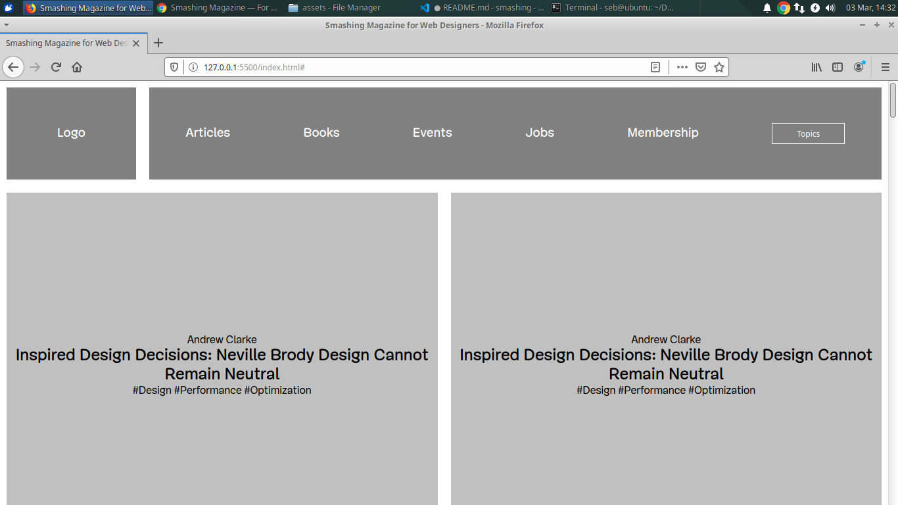

# Smashing Magazine Clone

> This is a wireframe of the Smashing Magazine website, where a shade of grays was used to highlight the hierarchy  of the elements in the page.

- Original site: https://www.smashingmagazine.com/

## Built With

- HTML5, CSS3
- Flexbox, Grid, Floats

## Live Demo

[Live Demo Link](https://rawcdn.githack.com/ghamtre/smashing/19d6b56081846ad9d3bffbf0663920709bf278bf/index.html)

## Authors

👤 **Author1**

- Github: [@ghamtre](https://github.com/ghamtre)
- Twitter: [@idgm5](https://twitter.com/idgm5)
- Linkedin: [linkedin](https://www.linkedin.com/in/isaacmunguia/)

👤 **Author2**

- Github: [@lBuggie](https://github.com/lBuggie)
- Twitter: [@sebGilR](https://twitter.com/sebGilR)
- Linkedin: [linkedin](https://www.linkedin.com/in/sebasti%C3%A1n-gil-rodr%C3%ADguez-9b776073/)

## 🤝 Contributing

Contributions, issues and feature requests are welcome!

Feel free to check the [issues page](issues/).

## Show your support

Give a ⭐️ if you like this project!

